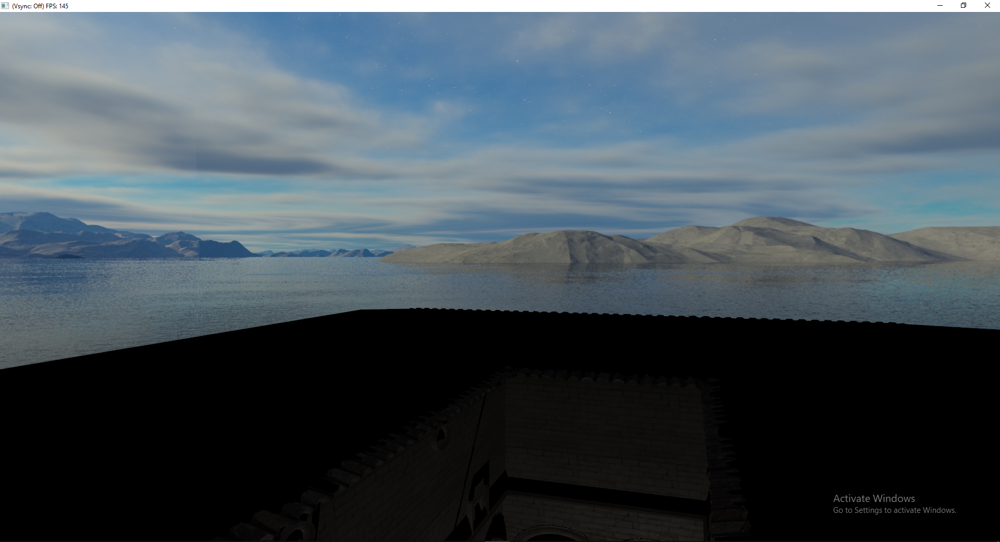
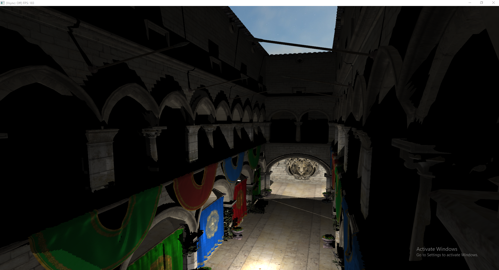
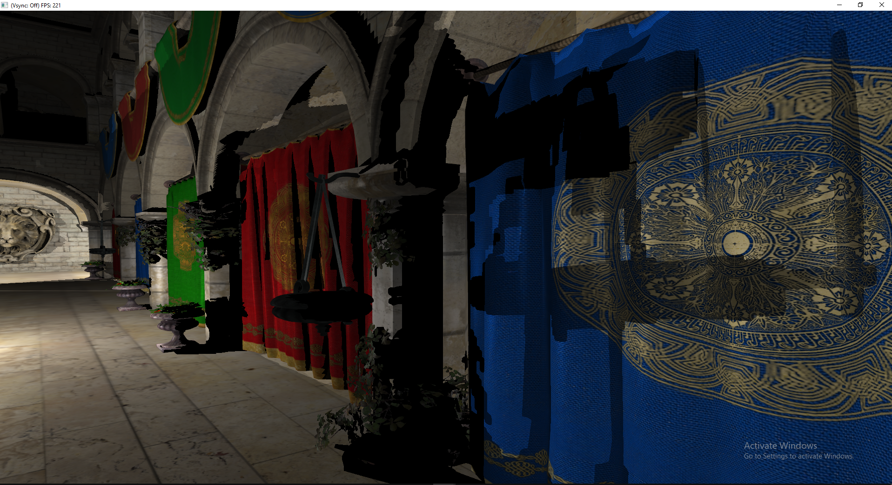
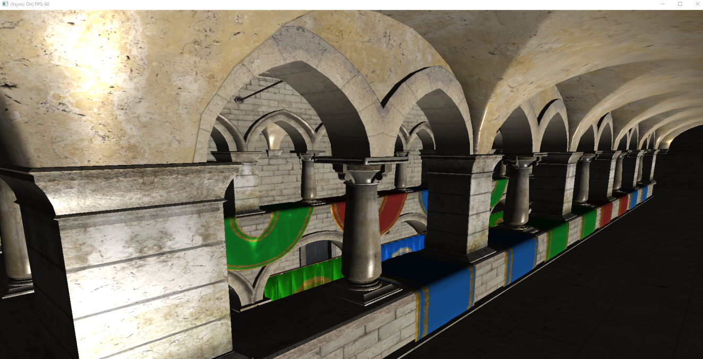

# OpenGL renderer made in C# with OpenTK

First OpenGL project; struggled to learn C++ at the same time so sticked with C# and found OpenTK which allows you to do mostly everything C++ OpenGL does besides write a performant program (in case it is written by me).

This is a diffuse/specular renderer, no PBR.

# Features
    Mouse and cursor input
    Model loading using ASSIMP.Net
    Texture loading 
    Skybox
    Programmable Shaders (1999 called, they want their brand new feature back)
    Point, Spot and Directional light system
    Omnidirectional shadow mapping (this is very crude and without PCF because yours truly was too lazy to get proper slope adjustment going)
    Antialiasing (I totally implemented it from scratch and it didn't come with the framework, cough cough)
    VSync (same as above)

# Possible Feature Roadmap
    PBR
    Normal Mapping
    Parallax Mapping
    SSAO
    SSR

# Problems
Hardcoded path on the model (you'll figure it out)

Lots of things that a good programmer (https://github.com/deccer) from the Graphics Programming discord pointed out are in the Issues section, as I'm not maintaining this anymore.

Shadowmaps look straight outta 1999, I tried using an atlas but my math isn't strong enough and my motivation died along with my mental health when trying to understand how they worked.

# Multiple shadowmaps
Since I am a master of optimization, I'm using a framebuffer with an attached cubemap for each omnidirectional shadowmap. Each light has a framebuffer, and every time the lights update it renders the scene once per light and binds the resulting cubemaps as a samplerCube array to the shader.

`uniform samplerCube depthMaps[NR_POINT_LIGHTS];`

Minimum specs: 2x GTX Titan X SLI

# In Conclusion
You might want to hire someone else to write your engine, unless you don't like performance.

Here's some screenshots:

## Skybox, its level of beautifulness is totally because of my programming skills and not the artist who made it

## Model and texture loading from OBJ file using assimp

## Multiple point lights with shadows

## Omnidirectional Shadowmaps

## Early test with a directional light and no shadows

